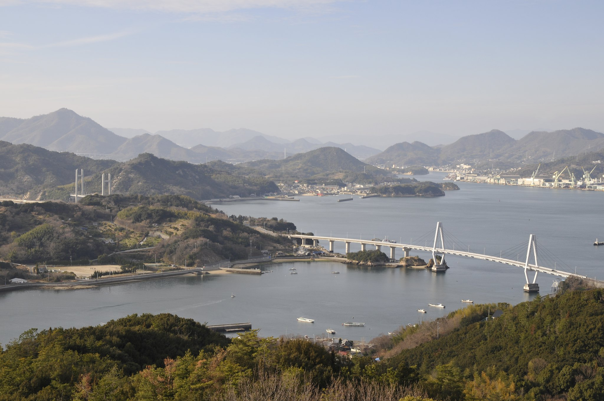
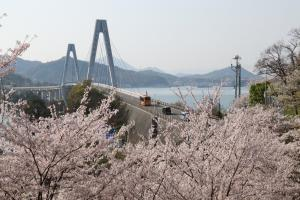
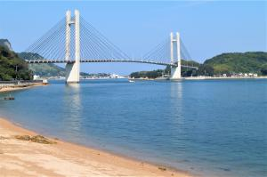
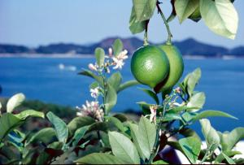
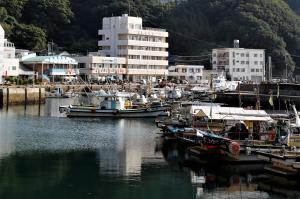

---
# Feel free to add content and custom Front Matter to this file.
# To modify the layout, see https://jekyllrb.com/docs/themes/#overriding-theme-defaults

layout: home
title: "トップ"
list_title: "最近の投稿"
---

# 本ドキュメントについて
本ドキュメントはシビックテック団体、Code for Kamijima（コード・フォー・カミジマ）についてのドキュメントです。

## シビックテックとは？
シビックテックとは、市民が技術を使って地域の問題を解決する活動のことです。例えば、アイデアを出したり、デザインやプログラミングをすることで、みんなで力を合わせて社会の困りごとを解決しようとします。

Code for Kamijimaは愛媛県越智郡上島町（以下、上島町）に関わる全ての人の生活をより豊かにするためのシビックテック活動を行う団体です。 

この活動は、上島町に住む人・町外に住んでいる人誰もが参加できるオープンな活動です。

## 上島町とは？
上島町は、瀬戸内海のほぼ中央、愛媛と広島の間に点在する芸予諸島の中でも愛媛県側では最も北東に位置している離島です。
上島町の面積は、30.38平方キロメートルで、25の離島で構成されており以下の特徴を有しています。

- 気候: 瀬戸内海特有の温暖な気候
- 平均気温: 15～16度
- 年間降雨量: 1,000ミリメートル前後
- 積雪について: 冬期にもほとんど積雪なし

{:align="center"}
上島町の航空写真[^1]

周囲は、瀬戸内海国立公園区域に囲まれ、風光明媚な瀬戸内の景勝拠点地です。[^2]

弓削大橋と🌸 | 生名橋と🌊 | 岩城の🍋 | 魚島の⚓️
--- | --- | --- | ---
 |  |  | 

Code for Kamijimaはこの自然豊かな瀬戸内の離島をよりよくするための活動を行います！

---
　　
## 付録
- 本ドキュメントは[GitHub](https://github.com/atsuki-seo/my-dummy-site)で管理されたオープンソースです。

## 脚注
[^1]: [上島町 観光写真提供サービス 弓削・久司山展望台よりゆめしま海道を望む](https://flic.kr/p/rjCRoU)
[^2]: [上島町公式HP 町の紹介・概要](https://www.town.kamijima.lg.jp/soshiki/4/37.html)